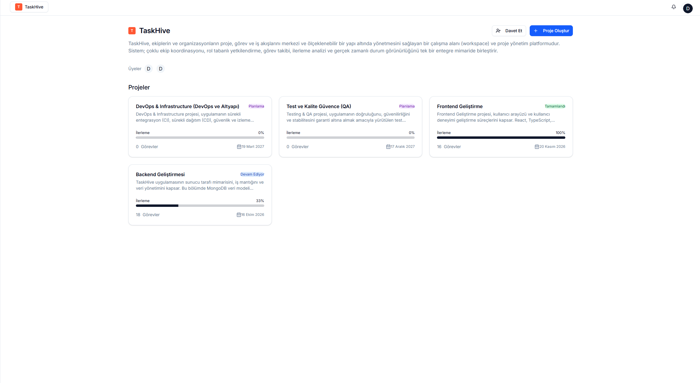

# TaskHive 🚀
Modern, cloud-ready **MERN Stack Project & Task Management** uygulaması.  
Workspace bazlı ekip yönetimi, proje takibi, Kanban görev akışı, görev detayları (subtask/yorum/izleyen/aktivite) ve istatistik paneliyle uçtan uca bir iş yönetimi deneyimi sunar.

🔗 Repository: https://github.com/DogukanErzurum/TaskHive

---

## ✨ Özellikler
- **Workspace (Çalışma Alanı) Yönetimi**
  - Workspace oluşturma, listeleme
  - Üye davet etme, rol bazlı yetkilendirme (owner/admin/member/viewer)
- **Proje Yönetimi**
  - Proje oluşturma, listeleme, durum takibi
  - Proje ilerleme yüzdesi
- **Görev Yönetimi (Kanban)**
  - To Do / In Progress / Done akışı
  - Öncelik, bitiş tarihi, assignee yönetimi
- **Görev Detay Ekranı**
  - Alt görevler (subtasks)
  - Yorumlar
  - İzleyenler (watchers)
  - Aktivite zaman çizelgesi (audit trail)
- **İstatistikler**
  - Görev trendleri
  - Proje durum dağılımı
  - Öncelik dağılımı
  - Çalışma alanı verimliliği (tamamlanan görevler)
- **Auth & Güvenlik**
  - JWT Authentication
  - E-posta doğrulama
  - Şifre sıfırlama

---

## 🧱 Teknoloji Stack
### Frontend
- React + TypeScript
- React Router v7 (SSR enabled)
- Shadcn UI + TailwindCSS v4
- TanStack Query, Axios
- Recharts (istatistik grafikleri)

### Backend
- Node.js + Express
- MongoDB + Mongoose
- JWT Authentication
- Zod validation (zod-express-middleware)
- SendGrid (mail servisleri)
- Arcjet (rate limit / bot shield / email validation)

---

## 🖼️ Ekran Görüntüleri
> Görseller `Görseller/` klasöründen çekiliyor.

### Çalışma Alanları


### Projeler


### Görevler (Kanban)


### Görev Detayları


### Görevlerim


### İstatistikler


### Profil


### Proje Üyeleri


---

## ⚙️ Kurulum (Local)
> Monorepo: `frontend/` ve `backend/` ayrı çalışır.

### 1) Backend
```bash
cd backend
npm install
npm run dev
