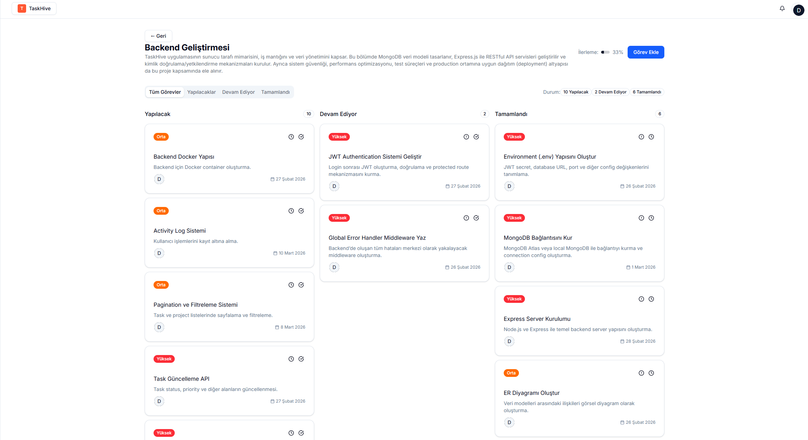
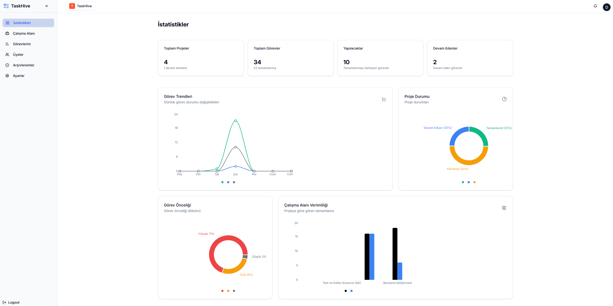

<div align="center">

# 🐝 TaskHive

### Modern MERN Stack Project & Task Management Platform

Full-stack, workspace-based project and task management system built using **MongoDB, Express.js, React, Node.js, and TypeScript**


</div>

---

# 📌 Overview

**TaskHive** is a modern, scalable, full-stack **project and task management platform** designed to help individuals and teams manage their workflows efficiently within a centralized workspace system.

The application allows users to create workspaces, manage projects, assign tasks, track progress, and monitor productivity through an intuitive and modern interface.

This project was built to simulate a **real-world, production-ready enterprise project management system**, focusing on:

• scalable architecture  
• secure authentication and authorization  
• modern UI/UX design  
• clean backend API structure  
• maintainable and modular code  

---

# 🖼️ Application Screenshots

## Workspace Management


## Projects Dashboard


## Kanban Task Board


## Task Detail, Activity Timeline, Comments


## Personal Tasks View


## Statistics Dashboard


## Profile Management


## Workspace Members Management


---

# ✨ Features

## Workspace Management

• Create and manage multiple workspaces  
• Invite members via secure invitation links  
• Role-based access control  

---

## Project Management

• Create projects within workspaces  
• Track project progress  
• Monitor project status  

---

## Task Management

• Kanban board workflow (To Do, In Progress, Completed)  
• Assign tasks to users  
• Priority management  
• Subtasks support  
• Comment system  
• Activity timeline (audit log)  
• Task watchers  

---

## Analytics Dashboard

• Task trend visualization  
• Priority distribution charts  
• Project completion statistics  
• Workspace productivity insights  

---

## Authentication & Security

• JWT-based authentication  
• Email verification system  
• Password reset functionality  
• Protected API routes  

---

# 🧱 Tech Stack

## Frontend

React  
TypeScript  
React Router v7  
TailwindCSS v4  
Shadcn UI  
TanStack Query  
Axios  
Recharts  

---

## Backend

Node.js  
Express.js  
MongoDB  
Mongoose  
JWT Authentication  
Zod Validation  
SendGrid Email Service  
Arcjet Security  

---

# 📂 Project Structure

```
TaskHive
│
├── frontend
│   └── React frontend application
│
├── backend
│   └── Express REST API
│
├── Görseller
│   └── Application screenshots
│
└── README.md
```

---

# ⚙️ Local Installation

## Clone Repository

```bash
git clone https://github.com/DogukanErzurum/TaskHive.git
cd TaskHive
```

---

## Run Backend

```bash
cd backend
npm install
npm run dev
```

Backend runs on:

```
http://localhost:5000
```

---

## Run Frontend

```bash
cd frontend
npm install
npm run dev
```

Frontend runs on:

```
http://localhost:5173
```

---

# 🔐 Environment Variables

Create a `.env` file inside the **backend** folder:

```
PORT=5000

MONGODB_URI=your_mongodb_connection_string

JWT_SECRET=your_secret_key

SEND_GRID_API=your_sendgrid_api_key

FROM_EMAIL=your_verified_email

ARCJET_KEY=your_arcjet_key

FRONTEND_URL=http://localhost:5173
```

---

# 🚀 Future Improvements

• Docker support  
• Automated testing (Jest / Vitest)  
• CI/CD pipeline  
• Performance optimization  
• Advanced analytics and reporting  
• Microservice-ready architecture  

---

# 👨‍💻 Author

**Doğukan Erzurum**

GitHub  
https://github.com/DogukanErzurum

LinkedIn  
https://linkedin.com

---

# 📄 License

MIT License

Copyright (c) 2026 Doğukan Erzurum

Permission is hereby granted, free of charge, to any person obtaining a copy of this software and associated documentation files to deal in the Software without restriction, including without limitation the rights to use, copy, modify, merge, publish, distribute, sublicense, and/or sell copies of the Software.

THE SOFTWARE IS PROVIDED "AS IS", WITHOUT WARRANTY OF ANY KIND.
